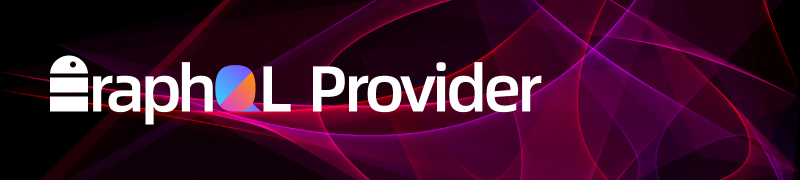

# A GRM *(GraphQL relation mapping)*, which is very similar to ORM, allowing users to quickly build a GraphQL server based on RDBMS (using kotlin and R2DBC)

## This project is deprecated, please view the new project "https://github.com/babyfish-ct/jimmer".

## Reason: kimmer supports only kotlin-api; jimmer supports both kotlin-api and java api.
