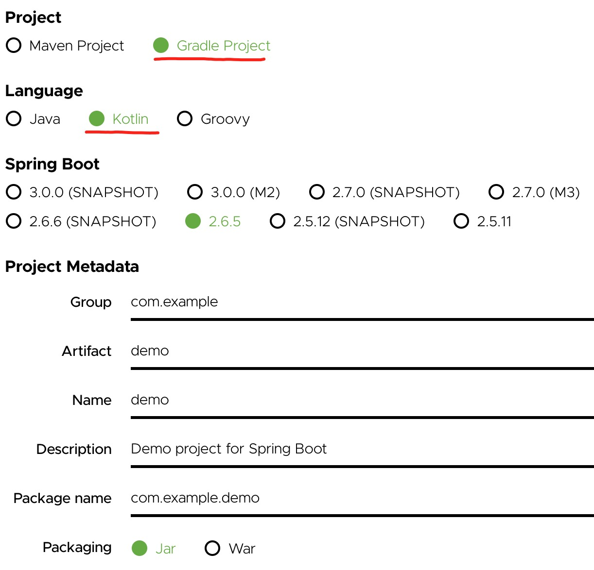
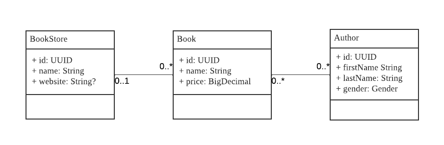

# [graphql-provider](https://github.com/babyfish-ct/graphql-provider)/Create project & Define entities

## 1. Create project

Visit https://start.spring.io/, create a Spring boot project, select **Gradle project** and **Kotlin**




## 2. UML diagram of entity objects



1. There are three entities: *BookStore*, *Book* and *Author*
2. There is a many-to-one association from *Book* to *BookStore*: *Book.store*
3. There is a one-to-many association from *BookStore* to *Book*: *BookStore.books*
4. There is a many-to-many association from *Book* to *Author*: *Book.authors*
5. There is a many-to-many association from *Author* to *Book*: *Author.books*

## 3. Add dependencies

Modify the "build.gradle.kts", add the following three dependencies under *dependencies {}*

```
dependencies {
    implementation("org.babyfish.graphql.provider:graphql-provider-starter-dgs:0.0.5")
    ksp("org.babyfish.kimmer:kimmer-ksp:0.3.1")
    runtimeOnly("io.r2dbc:r2dbc-h2:0.8.5.RELEASE")
}
```
1. The first dependency is graphql-provider
2. The second dependency is a gradle tool required by [kimmer](https://github.com/babyfish-ct/kimmer), it is used to generate some source code files
3. The third dependency is R2DBC driver of H2 database

## 4. Define entity types by kotlin

Create a new package *com.example.demo.model*, add 4 files under it: *BookStore.kt*, *Book.kt*, *Author.kt*, *Gender.kt*

1. BookStore.kt
    ```kt
    package com.example.demo.model

    import org.babyfish.kimmer.sql.Entity
    import java.util.*

    interface BookStore: Entity<UUID> {
        val name: String
        val website: String?
        val books: List<Book>
    }
    ```
2. Book.kt
    ```kt
    package com.example.demo.model
    
    import org.babyfish.kimmer.sql.Entity
    import java.math.BigDecimal
    import java.util.*

    interface Book: Entity<UUID> {
        val name: String
        val store: BookStore?
        val price: BigDecimal
        val authors: List<Author>
    }
    ```
3. Author.kt
    ```kt
    package com.example.demo.model
    
    import org.babyfish.kimmer.sql.Entity
    import java.util.*

    interface Author: Entity<UUID> {
        val firstName: String
        val lastName: String
        val gender: Gender
        val books: List<Book>
    }
    ```
4. Gender.kt
    ```kt
    package com.example.demo.model
    
    enum class Gender {
        MALE,
        FEMALE
    }
    ```
    
## 5. Generate source code required by strongly typed SQL DSL.

In order to use the strongly typed SQL DSL to maximize the development experience, some source code needs to be generated based on the entity interfaces. Please modify "build.gradle.kts".

1. Add google ksp into *plugins {}*
    ```
    plugins {
        
        ... other plugins ...
        
        id("com.google.devtools.ksp") version "1.6.10-1.0.2"
    }
    ```
    Click the refresh button on the gradle panel to let intellij download the plugin
    
2. Configure arguments of google ksp
    ```
    ksp {
        arg("kimmer.draft", "false") // α
        arg("kimmer.table", "true") // β
        arg("kimmer.table.collection-join-only-for-sub-query", "true") // γ
    }
    ```
    - α: Do not generate the source code required by [kimmer](https://github.com/babyfish-ct/kimmer/blob/main/doc/kimmer-core/README.md), which is not required for this example
    - β: Generate the source code required by [kimmer-sql](https://github.com/babyfish-ct/kimmer/blob/main/doc/kimmer-sql/README.md), which is required for this example
    - γ: Prohibit the use of collection joins in top-level queries. This switch allows developers to develop better programming habits, click [here](https://github.com/babyfish-ct/kimmer/blob/main/doc/kimmer-sql/contains.md) for more information

3. Add the generated code to the gradle build path *(important but easy to forget)*
    ```kt
    kotlin {
        sourceSets.main {
            kotlin.srcDir("build/generated/ksp/main/kotlin")
        }
    }
    ```
    
Now, you can run the app, the code required for the strongly typed SQL DSL will be automatically generated.

> If you run the app now, you will get an exception because the current project does not have any substantive code and does not provide GraphQL queries. However, that's okay, the exception doesn't prevent code generation.

## 6. Global configuration

1. Automatically initialize the H2 database when the app starts

    Create a file *data.sql* under *src/main/resouces*. Due to the large amount of sql code, the sql code is not listed here and you can copy the sql code from [example/src/main/resources/data.sql](https://github.com/babyfish-ct/graphql-provider/blob/main/example/src/main/resources/data.sql).

    Change class *com.example.demo.DempApplciation*, add a spring bean

    ```kt
    @Bean
    fun connectionFactoryInitializer(
        connectionFactory: ConnectionFactory
    ): ConnectionFactoryInitializer =
        ConnectionFactoryInitializer().apply {
            setConnectionFactory(connectionFactory)
            setDatabasePopulator(ResourceDatabasePopulator(ClassPathResource("data.sql")))
            afterPropertiesSet()
        }
    ```
    
2. Let [kimmer-sql](https://github.com/babyfish-ct/kimmer/blob/main/doc/kimmer-sql/README.md) use dialect of H2 database

    Change class *com.example.demo.DempApplciation*, add a spring bean

    ```kt
    @Bean
	fun dialect() = 
        org.babyfish.kimmer.sql.runtime.dialect.H2Dialect()
    ```
    
3. Tell [kimmer-sql](https://github.com/babyfish-ct/kimmer/blob/main/doc/kimmer-sql/README.md) how to map the enum *com.example.demo.model.Gender*

    Change class *com.example.demo.DempApplciation*, add a spring bean
    
    ```kt
    @Bean
	fun genderProvider() =
		enumProviderByString(Gender::class) {
			map(Gender.MALE, "M")
			map(Gender.FEMALE, "F")
		}
    ```
    
    > kimmer-sql provides two ways to map enum
    > 1. enumProviderByString
    >   This means to map the enum to a string
    >   - By default the name of the enum is used
    >       ```kt
    >       enumProviderByString(Gender::class) // MALE, FEMALE
    >       ```
    >   - You can override the default behavior with custom strings
    >       ```kt
    >       enumProviderByString(Gender::class) { // M, F
	>.          map(Gender.MALE, "M")
	>           map(Gender.FEMALE, "F")
	>       }
    >       ```
    > 2. enumProviderByInt
    >   This means to map the enum to a intrger
    >   - By default the ordinal of the enum is used
    >       ```kt
    >       enumProviderByInt(Gender::class) // 0, 1
    >       ```
    >   - You can override the default behavior with custom strings
    >       ```kt
    >       enumProviderByInt(Gender::class) { // 100, 200
	>.          map(Gender.MALE, 100)
	>           map(Gender.FEMALE, 200)
	>       }
    >       ```

--------------

[Home](https://github.com/babyfish-ct/graphql-provider) | [Next: Map entities>](./entity-mapper.md)

